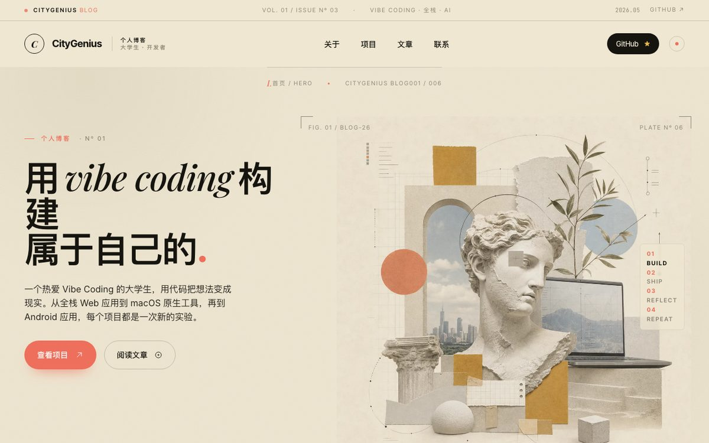
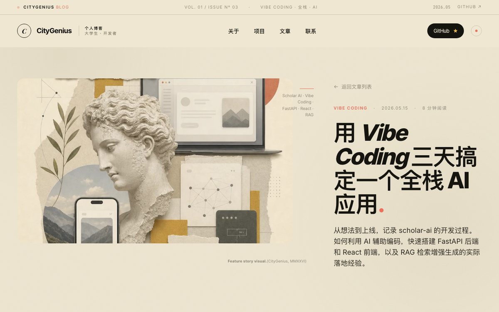
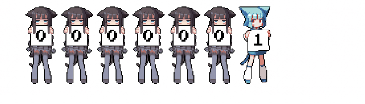

  

  

  <i>“Talk is cheap. Show me the code.” — Linus Torvalds</i> 
  <i>“Premature optimization is the root of all evil.” — Donald Knuth</i> 
  <i>“Simple is better than complex.” — Tim Peters</i>

<h1 align="center">👋 Hello，here is 37chengshan</h1>

  <b>学生</b> · 全栈开发 · Web / App / 跨端 
  <b>Skills</b> · Agent 编排 
  明日方舟 · Goldenglow

  
  
  
  
  

  
  
  

## 🌟 关于我

还在读书。写过 Web、App、小程序，啥技术栈都在城市。平时主要在玩各种ai，自己做点开源项目，空下来会折腾  Skills 和 Agent 编排，自己造点顺手的工具。另外喜欢机器人，也玩明日方舟（澄闪厨）。

  
<b>🤖 Agent 与 Claude Skills (点击展开)</b>

   
  <ul>
    <li><b>Claude Skills:</b> 自己写 Skill，把常用流程做成可复用的东西</li>
    <li><b>工作流:</b> Multi-Agent 分工、子代理协作、跨会话接着干</li>
    <li><b>提示工程:</b> 结构化输出、约束验证、上下文怎么塞</li>
    <li><b>常用工具:</b> Claude Code · Cursor · MiMo Desktop</li>
    <li><b>兴趣:</b> 机器人交互 · 游戏 AI（明日方舟）</li>
  </ul>

  
<b>💻 全栈交付 (点击展开)</b>

   
  <ul>
    <li><b>语言:</b> TypeScript · JavaScript · Python · Java · C/C++</li>
    <li><b>前端:</b> Vue 3 · React · Next.js · Nuxt · TailwindCSS</li>
    <li><b>后端:</b> Spring Boot · FastAPI · Node.js · Django</li>
    <li><b>跨端:</b> React Native · Uniapp · 微信小程序 · Electron</li>
    <li><b>数据:</b> MySQL · Redis · MongoDB · PostgreSQL</li>
  </ul>

  
<b>🛠️ 工程化与设计 (点击展开)</b>

   
  <ul>
    <li><b>DevOps:</b> Docker · Linux · Nginx · Git · GitHub Actions</li>
    <li><b>构建:</b> Vite · Webpack · pnpm · CI/CD</li>
    <li><b>设计:</b> Figma · UI/UE</li>
    <li><b>方法:</b> 先把需求拆小，每步都能验证</li>
  </ul>

## 🌟 精选项目

  

<table>
  <tr>
    <td width="50%" align="center">
      
       
      <a href="https://github.com/37chengshan/agent-mcp"><b>agent-mcp</b></a>
      · Agent 编排工具链
       
      
      · <a href="https://37chengshan.github.io/citygenius-blog/article/project-agent-mcp/">想法→实现</a>
    </td>
    <td width="50%" align="center">
      
       
      <a href="https://github.com/37chengshan/eduevidence"><b>eduevidence</b></a>
      · 证据驱动的 AI 教学
       
      
      · <a href="https://37chengshan.github.io/citygenius-blog/article/project-eduevidence/">想法→实现</a>
    </td>
  </tr>
  <tr>
    <td width="50%" align="center">
      
       
      <a href="https://github.com/37chengshan/d-token"><b>d-token</b></a>
      · Token 工具链
       
      
      · <a href="https://37chengshan.github.io/citygenius-blog/article/project-d-token/">想法→实现</a>
    </td>
    <td width="50%" align="center">
      
       
      <a href="https://github.com/37chengshan/ompweb"><b>ompweb</b></a>
      · OMP Agent 的 Web 界面
       
      
      · <a href="https://37chengshan.github.io/citygenius-blog/article/project-ompweb/">想法→实现</a>
    </td>
  </tr>
  <tr>
    <td colspan="2" align="center">
      
       
      <a href="https://github.com/37chengshan/phone-lyrics-mac"><b>phone-lyrics-mac</b></a>
      · 手机 QQ 音乐 → Mac 桌面歌词
       
      
    </td>
  </tr>
</table>

  

## 📊 数据

  
  
  
   
  
  
  

## 🛠️ 技能与工具

  
  
  

## 🐍 GitHub 活动

  <picture>
    <source media="(prefers-color-scheme: dark)" srcset="https://raw.githubusercontent.com/37chengshan/37chengshan/output/github-contribution-grid-snake-dark.svg">
    <source media="(prefers-color-scheme: light)" srcset="https://raw.githubusercontent.com/37chengshan/37chengshan/output/github-contribution-grid-snake.svg">
    
  </picture>
  

## 📝 博客 · CityGenius

  

<table>
  <tr>
    <td width="50%" align="center">
      
    </td>
    <td width="50%" align="center" valign="middle">
      <b>CityGenius Blog</b> 
      一个大学生的 Vibe Coding 实验室  
      全栈 · AI 应用 · 移动端  
      
    </td>
  </tr>
</table>

<h3 align="center">✨ 感谢访问我的 GitHub 主页</h3>

  

